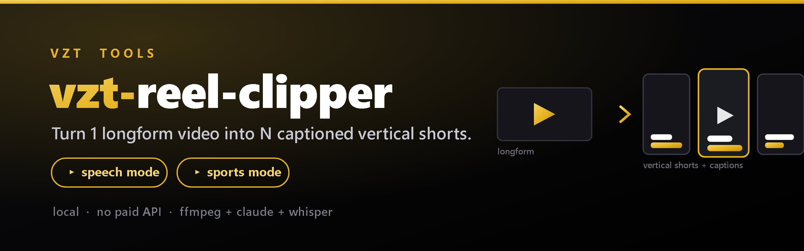

<p align="center">
  
</p>

<p align="center">
  <a href="#">= 20"></a>
  <a href="LICENSE"></a>
  <a href="#"></a>
  <a href="#"></a>
</p>

# vzt-reel-clipper

Local AI agent that turns **1 longform video → N captioned vertical shorts** — the thing those "AI clips agent" reels are selling, except it runs on your own machine with **no paid API**. Transcription is local; moment selection runs through your **`claude` *or* `codex` CLI** subscription (`--engine`, default `claude`).

**Two selection modes:**

| mode | for | how it picks moments | captions |
|---|---|---|---|
| `speech` *(default)* | podcasts, talking-head, lessons | transcript → `claude` picks best spoken moments | animated word-by-word |
| `sports` | game film (raw sideline / phone-from-stands) | **audio-energy peaks** (crowd, contact, whistles) | "Big Play N" banner |

Both reframe to **9:16 (1080×1920)**, burn captions with ffmpeg, write a `clips.json` manifest, and can stitch a highlight reel with `--reel`.

## Contents

- [Requirements](#requirements)
- [Install](#install)
- [How to use](#how-to-use) · [full step-by-step guide ›](docs/HOW-TO-USE.md)
- [Usage](#usage)
- [Sports mode](#sports-mode)
- [YouTube input](#youtube-input)
- [Options](#options)
- [Output](#output)
- [How it works](#how-it-works)
- [Limitations](#limitations)

## Requirements

| tool | needed for |
|---|---|
| **ffmpeg / ffprobe** (on PATH) | everything (cut, reframe, captions, audio analysis) |
| **node ≥ 20** | the CLI |
| **claude** *or* **codex** CLI (logged in) | speech-mode moment selection (`--engine`) |
| **vintel** (`vzt-video-intel`) CLI | local transcription (first run downloads a ~75 MB Whisper model) |
| **yt-dlp** + **deno** | only the YouTube input path |

Sports mode needs only ffmpeg + node.

## Install

```bash
git clone https://github.com/vonzelle-vzt/vzt-reel-clipper.git
cd vzt-reel-clipper
npm install
npm link        # optional — puts `vzt-reel-clipper` (and `reelclip`) on PATH
npm test        # optional — self-contained smoke tests
```

## How to use

> 📖 **New here?** This is the short version — the full hand-holding walkthrough
> (with troubleshooting) lives in **[docs/HOW-TO-USE.md](docs/HOW-TO-USE.md)**.

**Step 1 — sanity check** (after install):

```bash
vzt-reel-clipper --version     # 0.1.0
vzt-reel-clipper --help        # every option
```

**Step 2 — pick the mode that matches your footage:**

- **`speech`** *(default)* — anything with talking: podcasts, interviews,
  lessons, talking-head reels. It reads the words and picks the best moments.
- **`sports`** — game film with little/no speech (raw sideline, hudl, phone from
  the stands). It finds the action by **loud moments** (crowd, contact, whistles).

**Step 3 — run it:**

```bash
# Talking video → 5 captioned vertical shorts in ./clips
vzt-reel-clipper "C:\Users\neilv\Videos\podcast.mp4"

# Game film → big-play shorts + one stitched highlight reel
vzt-reel-clipper "C:\film\full-game.mp4" --mode sports --reel
```

It prints the clips it chose, then drops finished `.mp4`s (ready for
TikTok/Reels/Shorts) plus a `clips.json` manifest into the output folder.

**Tuning, in one line each:**

```bash
vzt-reel-clipper video.mp4 -n 8 --min 20 --max 45 --font Impact   # speech: more/shorter clips, font
vzt-reel-clipper game.mp4 --mode sports --sensitivity 0.7         # sports: quiet film → more clips
vzt-reel-clipper game.mp4 --mode sports --preroll 8 --postroll 5  # sports: widen the play window
vzt-reel-clipper video.mp4 --engine codex                        # use Codex (GPT) instead of Claude
vzt-reel-clipper "https://youtu.be/XXXX" --cookies-from-browser firefox   # from a YouTube link
```

**Choosing the brain (`--engine`):** moment selection runs through whichever CLI
you're logged into — `claude` (default) or `codex`. Both use your existing
subscription, so neither adds an API bill. Sports mode doesn't call an LLM at
all, so `--engine` only matters in speech mode.

> Stuck? See the [troubleshooting table](docs/HOW-TO-USE.md#6-troubleshooting).

## Usage

```bash
# Local file → 5 captioned shorts into ./clips
vzt-reel-clipper "C:\path\to\lecture.mp4"

# Pick how many, set length bounds, choose font, output dir
vzt-reel-clipper lecture.mp4 -n 8 --min 20 --max 50 --font "Impact" -o out/

# Just cut + reframe, no captions
vzt-reel-clipper lecture.mp4 --no-captions

# GAME FILM → big-play shorts + a stitched team highlight reel
vzt-reel-clipper "C:\film\full-game.mp4" --mode sports -n 8 --reel

# YouTube (needs cookies — see below)
vzt-reel-clipper "https://www.youtube.com/watch?v=XXXX" --cookies-from-browser firefox
```

> `reelclip` is a shorter alias for the same command.

## Sports mode

Game film has no usable speech, so `--mode sports` ignores transcripts and finds
the action by **audio loudness peaks** (ffmpeg `ebur128`) — crowd reaction,
contact, and whistles all spike the audio. Each peak becomes a clip starting
`--preroll` seconds *before* the spike (to catch the snap/buildup) and ending
`--postroll` after.

```bash
vzt-reel-clipper game.mp4 --mode sports --reel            # clips + one team reel
vzt-reel-clipper game.mp4 --mode sports --sensitivity 0.7 # quieter film → more clips
vzt-reel-clipper game.mp4 --mode sports --preroll 8 --postroll 4
```

- **Phone-from-stands** film works best (loud crowd). **Raw sideline** film works
  off contact/whistle spikes — lower `--sensitivity` (e.g. `0.7`) if it finds too few.
- `count` is a **maximum** — weak peaks are dropped, so a quiet game yields fewer
  *real* clips rather than padding the reel with non-plays.
- `--reel` concatenates the clips into one `00-highlight-reel.mp4`.
- This is **not** per-athlete recruiting reels — that's player tracking (a job for
  [NextPlay](https://nextplay)-style vision pipelines), not generic clipping.

## YouTube input

YouTube now (a) requires a JavaScript runtime and (b) bot-checks downloads, so the
YouTube path needs **deno** (auto-detected from `~/.deno/bin`) **and browser cookies**:

- **Easiest on Windows:** `--cookies-from-browser firefox` (Firefox cookies aren't DPAPI-encrypted).
- **Edge / Chrome** cookie decryption often fails with `Failed to decrypt with DPAPI`
  (Chromium app-bound encryption). Close the browser first, or export a `cookies.txt`
  ("Get cookies.txt" extension) and pass `--cookies cookies.txt`.

The **local-file path has none of this friction** — download a video however you
like, then point the tool at the file.

## Options

| flag | default | meaning |
|---|---|---|
| `-m, --mode <mode>` | `speech` | `speech` or `sports` |
| `-n, --count <n>` | 5 | number of clips (a **max** in sports mode) |
| `-o, --out <dir>` | `clips` | output directory |
| `--reel` | off | also stitch clips into one highlight reel |
| `--min / --max <sec>` | 18 / 60 | clip length bounds *(speech mode)* |
| `--preroll / --postroll <sec>` | 7 / 4 | seconds around each peak *(sports mode)* |
| `--sensitivity <n>` | 1.0 | peak threshold *(sports mode; lower = more clips)* |
| `-l, --language <iso>` | auto | transcription language hint |
| `-e, --engine <name>` | `claude` | LLM for moment selection: `claude` or `codex` |
| `--model <name>` | engine default | model override (claude → `sonnet`; codex → its config default) |
| `--font <name>` | `Arial` | caption font |
| `--no-captions` | off | skip burned-in captions |
| `--cookies <file>` | — | cookies.txt for YouTube |
| `--cookies-from-browser <b>` | — | firefox / edge / chrome |
| `-v, --version` | | print version |

## Output

```
clips/
  00-highlight-reel.mp4     # only with --reel
  01-<hook-title>.mp4
  02-<hook-title>.mp4
  …
  clips.json                # manifest: start/end, titles, selection reasons
```

## How it works

```
                        ┌──────────── speech mode ────────────┐
input ─▶ resolve ─▶  ┤                                          ├─▶ render ─▶ clips/*.mp4
        (file/URL)    │  transcribe ─▶ select (claude)          │   (ffmpeg)   (+ reel)
                      └──────────── sports mode ────────────────┘
                         detect audio-energy peaks (ebur128)
```

- **Word-level captions:** YouTube auto-subs carry true per-word timing. Local
  transcription is segment-level, so word times are interpolated within each
  segment (good enough for the karaoke highlight; swap in a word-level ASR for
  frame-perfect timing).
- **Caption style** lives in `src/ass.js` (font, size, colors, highlight scale,
  lower-third position) — tweak there.

Full data flow and the ffmpeg/ASS gotchas are documented in
[`docs/ARCHITECTURE.md`](docs/ARCHITECTURE.md).

## Limitations

- Sports mode finds *that* a big moment happened, not *who* made the play — it
  can't yet frame on a specific player or read the scoreboard.
- Reframing is a center-crop; there's no speaker/subject tracking yet.
- Local caption timing is interpolated (see above).

## Built on the VZT stack

Reuses the pure-WASM Whisper backend from
[`vzt-video-intel`](https://www.npmjs.com/package/vzt-video-intel) and the `claude`
CLI subscription pattern from `tele-build-agent` — so it adds a capability without
adding a bill.

## License

[MIT](LICENSE) © VZT (vonzelle)
